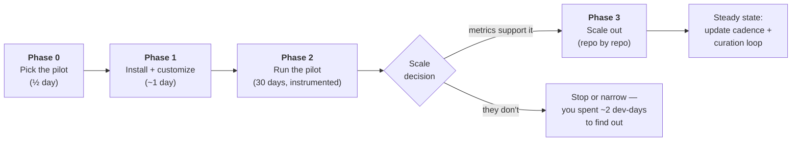
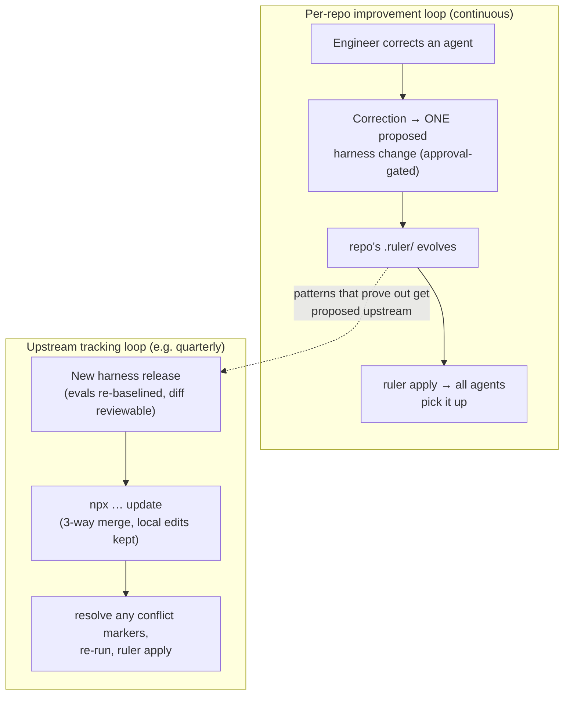

# Adoption playbook — pilot, measure, scale

**Audience:** the engineering leader or platform team running the rollout.
**Premise:** never adopt org-wide on faith. One repo, ~30 days, instrumented,
then a data-backed scale/stop decision. The harness's own philosophy — measured,
not believed — applies to adopting it too.

**Companions:** [WHY-A-HARNESS.md](WHY-A-HARNESS.md) (the case) ·
[ARCHITECTURE.md](ARCHITECTURE.md) (internals) · [README](../README.md) (install reference).

---

## The shape of the rollout



---

## Phase 0 — pick the pilot (half a day)

Choose **one repository** and **3–5 engineers** who already use AI agents daily.

Good pilot repo traits:
- A fullstack monorepo matching the harness's target shape (NestJS API + React
  web + shared contracts), actively developed — you want enough PRs in 30 days
  for the metrics to mean something (rule of thumb: ≥30 PRs).
- Has CI already; has at least some test culture (the harness *strengthens*
  test discipline; it can't bootstrap a culture war and a tooling change at once).
- Not your most politically sensitive codebase. Pick a team that opted in.

Capture the **baseline window now**, before anything changes: pull the last
30–60 days of the metrics in the framework below, so "before" isn't
reconstructed from memory later.

## Phase 1 — install and customize (~1 day for the first repo)

```bash
npx @tierone/llm-harness-fullstack init   # copies the harness into ./.ruler
npm i -D @intellectronica/ruler
npx ruler apply                            # generates CLAUDE.md, AGENTS.md, copilot-instructions, …
```

Then the three customization steps that make it *yours* — in priority order:

1. **Fill in `repo-conventions`** (`.ruler/skills/repo-conventions/SKILL.md`).
   It ships as a fill-in skeleton covering both tiers plus the shared-contract
   seam. This is the highest-leverage hour of the whole rollout: it's the file
   every agent *and* every review subagent treats as "what's correct for this
   repo." A senior engineer on the pilot team should own it.
2. **Copy the enforcement templates** from the `quality-gates` skill into
   place: `templates/ci.yml` → `.github/workflows/`, `templates/pre-commit` →
   `.husky/`, `templates/claude-settings.json` → `.claude/`. This is the
   deterministic layer — branch protection on `main`, typecheck/lint/test/e2e
   gates on every PR, agent-permission denies on push-to-main and prompts on
   deploy/DB-write commands. **Don't skip this step**: the measured finding
   behind the harness design is that instructions alone degrade under context
   load; the gates are what hold when they do.
3. **Decide your spec/ADR locations** if you don't have them (`docs/specs/`,
   `docs/decisions/`) — the spec-steward and reviewer agents will look for them.

Commit all of it. The harness travels with the repo: every engineer (and every
CI agent run) gets it on next pull, with nothing to install per-person.

## Phase 2 — run the pilot (30 days)

Let the team work normally. Three operating notes worth telling them up front:

- **The fast path exists.** Small, low-risk changes (≤2 files, single tier, no
  risky surface, no contract change, no new dependency) skip the review-agent
  fleet. If everything feels heavyweight, the path declarations are being
  ignored — that's a coaching moment, not a tooling failure.
- **Corrections are capture-able.** When an engineer corrects their agent
  ("stop doing X", "we discussed this"), the harness offers to convert that
  correction into a durable change (a skill edit, a convention line) —
  one proposed change, approval-gated. Encourage the team to say yes: this is
  how the harness adapts to your codebase instead of staying generic.
- **Review-agent findings are free signal.** When a subagent blocks something a
  human reviewer would have caught later (or wouldn't have caught at all),
  note it — those become your best internal adoption stories.

### The metrics framework

Measure the same things before and during. Don't invent targets up front;
collect honestly and read the deltas.

| Metric | Source | What it tells you |
|---|---|---|
| PR cycle time (open → merge) | GitHub | Net velocity effect: does upstream ceremony pay for itself in fewer review rounds? |
| Human review rounds per PR | GitHub | The intended first-order effect: review agents catch issues pre-PR, so humans review cleaner diffs |
| Review findings by source (human / review agent / CI gate) | PR comments + pilot log | Where defects are being caught — the goal is the discovery point moving earlier |
| Defect escape rate (bugs traced to pilot-window PRs) | issue tracker | The quality effect, visible with ~30–60 days' lag |
| Revert / hotfix count | git history | Cheap proxy for escaped defects |
| Test coverage trend on changed files | CI | TDD discipline's footprint — expect this to move quickly |
| Gate events (blocked main-pushes, prompted deploys/DB writes) | CI + permission logs | The risk layer working; each event is an incident that didn't happen |
| Engineer sentiment (1 short survey, week 4) | pilot team | Adoption is voluntary in practice; tools engineers resent get routed around |

A lightweight pilot log (a shared doc, one line per notable event: "security
reviewer caught missing role check on DELETE endpoint pre-PR") costs minutes
and produces the concrete examples the scale decision will actually turn on —
aggregate numbers persuade; specific caught-bugs convince.

### The decision

At day 30: deltas on cycle time, review rounds, and escapes; the gate-event
count; the caught-findings log; sentiment. Three honest outcomes — scale,
extend the pilot (signal unclear), or stop. Total sunk cost of a stop: about
two developer-days plus a filled-in conventions file you keep anyway.

## Phase 3 — scale out

Repo-by-repo, in descending order of (activity × risk). Per repo it's Phase 1
again, faster: `init`, fill in that repo's `repo-conventions` (the only
genuinely per-repo work), copy the gates, apply. Single-tier repos can use the
narrower sibling harnesses ([llm-harness-nest](https://github.com/TierOne-Studio/llm-harness-nest),
[llm-harness-react](https://github.com/TierOne-Studio/llm-harness-react)) —
same model, one stack.

Two organizational decisions to make explicit at scale:

- **Ownership.** Name a harness owner (platform team or a senior IC per org).
  They review correction-driven skill proposals, decide what graduates from
  one repo's conventions into a shared customization, and run the update cadence.
- **Fork vs. track.** Default: track upstream (`update` performs a 3-way merge
  that preserves local edits; conflicts surface as standard git markers, and
  `update --dry-run` works as a CI check). Fork only if your customizations
  diverge structurally — you then own the merge burden you just opted into.

## Steady state — the two loops



- **Update cadence:** treat harness updates like dependency updates — a named
  owner, a regular cadence, and the release's eval-baseline diff as the review
  artifact ("what behavior changed in this version" is a committed, inspectable
  number, not a changelog adjective).
- **Curation cadence:** periodically review the accumulated corrections and
  review-agent meta-findings; promote the recurring ones into skills or
  conventions. This is how the harness compounds: every correction an engineer
  makes once stops being something every engineer must remember.

---

## Cost summary (honest)

| Item | Cost | Recurs? |
|---|---|---|
| First-repo install + conventions + gates | ~1 day (senior IC) | once |
| Each additional repo | ~2–4 hours | per repo |
| Pilot instrumentation + log | ~2 hours setup, minutes/week | pilot only |
| Per-change ceremony (full path) | minutes per feature; bounded by the fast path for small changes | continuous |
| Update merge (tracking upstream) | usually zero-conflict; conflicts are standard git markers | per release |
| Harness ownership | a few hours/month at steady state | continuous |

What you get for it is itemized — with the measured evidence — in
[WHY-A-HARNESS.md](WHY-A-HARNESS.md) §4–5.
