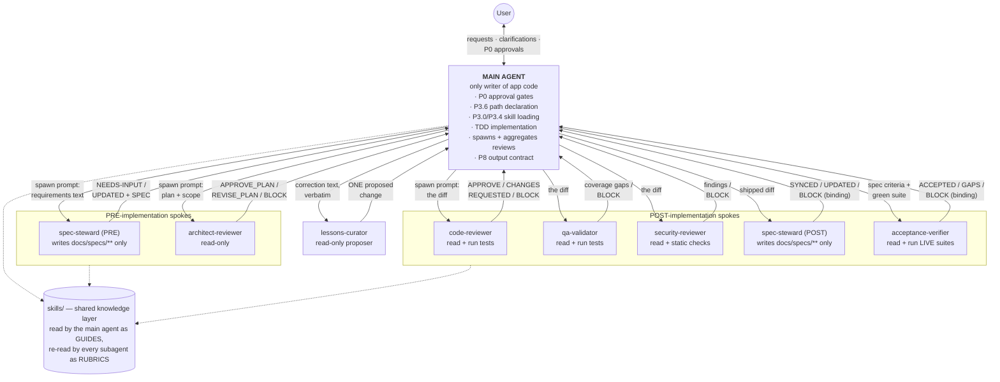
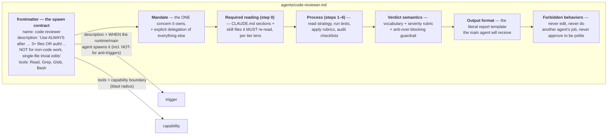
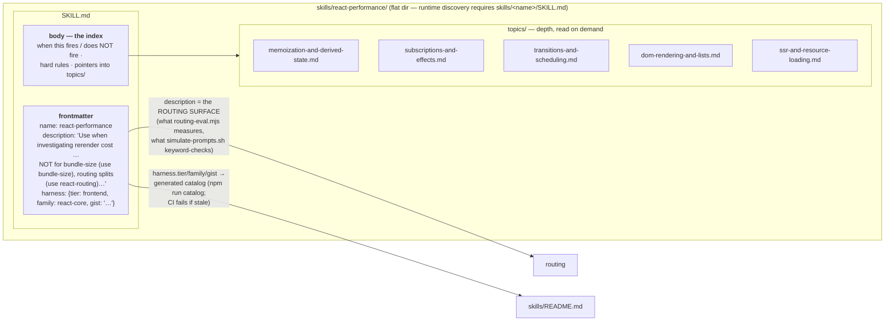
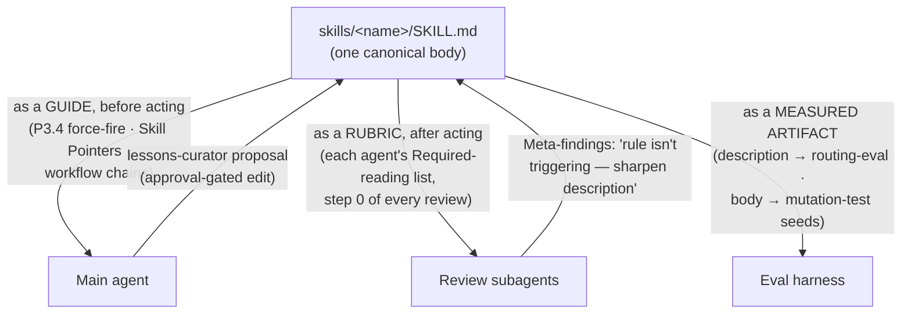
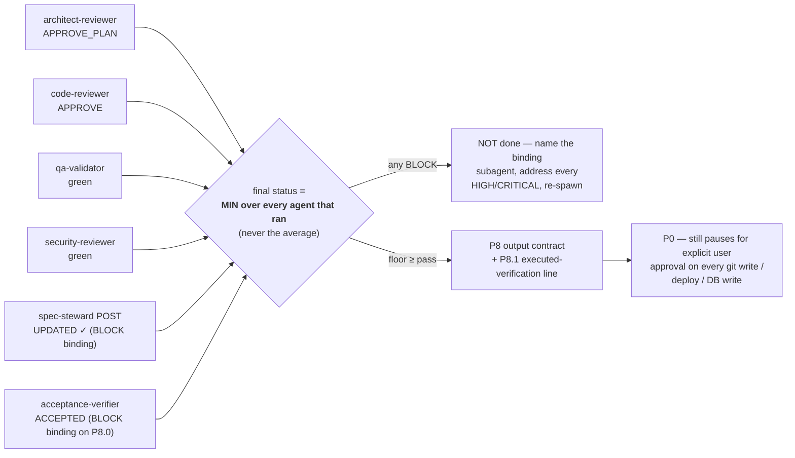

# Main agent & subagents — the runtime collaboration model (deep dive)

Companion to [ARCHITECTURE.md](ARCHITECTURE.md) §3. That document gives the
bird's-eye view of the three planes; this one zooms all the way in on the
**runtime**: who the main agent and the seven subagents are, what each is
responsible for, how they communicate (with the actual message shapes), and how
skills mechanically work as the shared knowledge layer — finished with a worked
end-to-end example.

Everything here is sourced from the shipped payload:
[instructions.md](../template/.ruler/instructions.md) (P0–P9),
[agents/*.md](../template/.ruler/agents/), and
[skills/*/SKILL.md](../template/.ruler/skills/).

---

## 1. Topology — a hub with seven spokes

The main agent is the **orchestrator and the only writer of application code**.
The seven subagents are **one-shot verifiers**: each is spawned for a single
review, runs in a **fresh context** (it does not see the conversation, the main
agent's reasoning, or its confidence), produces one structured Markdown report,
and terminates. Subagents never talk to each other — the main agent is the bus
that carries findings from one to the next.



Three properties of this topology are deliberate:

- **Independence by construction.** Fresh context means a subagent's verdict
  "is intentionally not influenced by the main agent's confidence"
  ([code-reviewer.md](../template/.ruler/agents/code-reviewer.md)). The main
  agent cannot argue a reviewer into approving; it can only fix the findings
  and re-spawn.
- **No shared memory — shared *sources*.** Subagents "work from current
  canonical sources, not baked-in memory": each one's first process step is to
  **re-read** `CLAUDE.md` and the relevant skill files itself. Alignment
  between writer and reviewers comes from both reading the same files, not
  from passing beliefs around.
- **Information passes only at two points.** Downstream: the spawn prompt (a
  diff, a plan, a correction — artifacts, not narrative). Upstream: the
  structured report. Everything else is invisible across the boundary.

---

## 2. Anatomy of a subagent — what an `agents/*.md` file actually is

Each subagent is one Markdown file. The runtime (Claude Code et al.) treats the
frontmatter as the **spawn contract** and the body as the subagent's **system
prompt**:



Two fields do the heavy lifting:

- **`description`** is the trigger. It is written like a routing rule — "Use
  ALWAYS after …" plus explicit **anti-triggers** ("NOT for trivial single-file
  edits, non-code work, incomplete implementations"). The P4 table in
  `instructions.md` is the deterministic backstop for the same conditions.
- **`tools`** is the capability boundary. Four reviewers get `Bash` but are
  told it's "read-only — running tests is fine; editing files is not"; none get
  `Edit`/`Write` except `spec-steward`, whose write scope is then narrowed
  *again* in prose to `docs/specs/**` only. Capability and mandate are fenced
  twice: once by the tool allowlist, once by Forbidden behaviors.

---

## 3. The shared review protocol

The five reviewers (`architect-reviewer`, `code-reviewer`, `qa-validator`,
`security-reviewer`, `acceptance-verifier`) all follow the same skeleton —
worth understanding once because every zoom-in below is a variation of it:

```mermaid
flowchart TB
    S0["<b>0 · Required reading</b><br/>re-read CLAUDE.md (P3/P4/P8) + the skill files for the<br/>tier lens(es) the diff touches — canonical sources, not memory"]
    S05["<b>0.5 · Discovery</b><br/>diff touches a surface not in the list? →<br/>scan .claude/skills/ for a matching description and read it.<br/>'Required Reading is the floor, not the ceiling'"]
    S1["<b>1 · Read the change — branch on size</b><br/>≤4 files / ≤500 LOC: read everything + one level of context<br/>&gt;4 files: RLM mechanics (from rlm-explore skill):<br/>LOCATE → EXTRACT → CHUNK → TRANSFORM → VERIFY<br/>→ distill a <b>Working Set</b> (5–15 bullets of what actually changed)"]
    S2["<b>2 · Run evidence</b><br/>tests for the touched tier(s) — failing tests = automatic BLOCK;<br/>static security checks; live suites (acceptance-verifier)"]
    S3["<b>3..n · Apply the rubrics</b><br/>the agent's own checklists + the SKILL bodies<br/>(design-review MUSTs, failure-mode 8 categories,<br/>repo-conventions per-tier tables, OWASP lens…)"]
    SV["<b>Verdict</b><br/>vocabulary per agent · severity HIGH/MED/LOW ·<br/>anti-over-blocking guardrail ('don't BLOCK on style<br/>preferences'; '5+ LOW items as reasons to withhold<br/>APPROVE = you're over-blocking')"]
    SR["<b>Structured report</b> → main agent<br/>verdict · scope · tests · Working Set · findings by severity ·<br/>rubric tables · Sources read · Confidence 0.XX ·<br/>optional Meta-findings"]
    S0 --> S05 --> S1 --> S2 --> S3 --> SV --> SR
```



Details that matter:

- **The Working Set is part of the report.** For large diffs the reviewer must
  show its 5–15-bullet distillation of what changed — the main agent (and the
  user) can audit *what the reviewer actually looked at*, not just its verdict.
- **`Sources read` and `Confidence: 0.XX`** close every report. Confidence is
  the reviewer's *independent* judgment, calibrated against anchors in the
  `design-review` skill — not a politeness score.
- **Meta-findings are the skill-improvement back-channel.** If a reviewer flags
  the same anti-pattern 3+ times in one review, it emits a `### Meta-findings`
  block ("rule in `<skill>` may not be triggering reliably; consider sharpening
  its description"). `lessons-curator` and `meta-skill-hygiene` consume these —
  reviews feed the evolution of the very skills they review against.
- **Forbidden behaviors are symmetric.** Every reviewer: never edits ("your
  verdict triggers the main agent to edit, not you"), never rewrites the
  solution, never does a sibling's job ("if you notice a critical gap outside
  your mandate, name it and tell the engineer to invoke the appropriate
  subagent"), never approves to be polite, never blocks on style.

---

## 4. Responsibilities, agent by agent

### 4.1 Main agent — the orchestrator

The only actor that touches `apps/**`, `packages/**`, tests, and config. Its
obligations per code change, in order:

| Step | Obligation | Observable artifact (what evals/reviewers check) |
|---|---|---|
| 1 | P3.6 path declaration | literal first line: `Path: fast — qualifies: …` / `Path: full — <disqualifier>` |
| 2 | P3.0 tier routing + P3.4 force-fire | loaded skills, or explicit `<skill> waived — <reason>` lines |
| 3 | P3.3 high-risk restate (auth/PII/contracts/…) | requirements restated in own words BEFORE tests |
| 4 | Spawn PRE agents per P4 triggers | spec-steward PRE, architect-reviewer |
| 5 | TDD per tier (`tdd-workflow`): red → minimal green, vertical slices | failing-test-first ordering; one of the four exact waiver phrases otherwise |
| 6 | `design-review` self-check | a `Design review:` marker block |
| 7 | Spawn POST agents; fix findings; re-spawn until clean | review verdicts quoted in the output |
| 8 | Aggregate = MIN of all verdicts | binding subagent named when one sets the floor |
| 9 | P8 output contract | last line = P8.1 verification line — every claim **executed**, no self-scored confidence |
| always | P0 gates | pause + explicit user approval before any git write / deploy / DB write / sensitive-data change |

The main agent also owns **escalation**: the moment a fast-path change stops
qualifying it must emit `Path: full — escalated: <reason>` and switch chains
mid-task (P5.7).

### 4.2 The seven subagents — one concern each

| | architect&#8209;reviewer | spec&#8209;steward | code&#8209;reviewer | qa&#8209;validator | security&#8209;reviewer | acceptance&#8209;verifier | lessons&#8209;curator |
|---|---|---|---|---|---|---|---|
| **Phase** | PRE | PRE + POST | POST | POST (∥ code-reviewer) | POST | POST, always LAST | on correction |
| **Input it receives** | the plan | requirements text (PRE) / shipped diff (POST) | the diff | the diff | the diff | spec criteria + the green suite | correction text, verbatim |
| **Owns** | plan-level design & risk (10× cost asymmetry) | `docs/specs/**` truth; ambiguity gate | design principles | coverage, edge cases, a11y, docs, compat | OWASP + SPA + NestJS security surfaces | EXECUTED acceptance proof, non-vacuity | one correction → one system change |
| **Core rubric (skill)** | `design-review` applied to the *plan*; `repo-conventions` | `spec-workflow` (readiness rubric) | `design-review` MUSTs; `repo-conventions` per-tier tables; P3.5 conflict rule | `failure-mode-analysis` 8 categories; test-quality rubric | OWASP top-10; `frontend-security`; three-tier boundary system | `tdd-workflow` rubric item 2 at the acceptance layer | `meta-skill-hygiene`; surveys skills/agents/CLAUDE.md |
| **Verdicts** | APPROVE_PLAN / REVISE_PLAN / BLOCK | NEEDS-INPUT / SYNCED / UPDATED / BLOCK **(binding)** | APPROVE / CHANGES REQUESTED / BLOCK | findings / BLOCK | findings / BLOCK | ACCEPTED / GAPS / BLOCK **(binding on "done")** | a proposal, approval-gated |
| **May write** | nothing | `docs/specs/**` ONLY | nothing (Bash = run tests) | nothing | nothing | nothing (Bash = run live suites) | nothing |

Distinguishing details per agent, beyond the table:

- **architect-reviewer** reads the plan plus *one level* of repo context and
  critiques scope discipline too — an oversized plan with no splitting strategy
  is a finding. It exists for the cost asymmetry: "a flaw caught here is ~10×
  cheaper than the same flaw caught in `code-reviewer` after tests +
  implementation exist."
- **spec-steward** is the only writer among the subagents, and the guardrail is
  hard: `docs/specs/**` plus the spec index, nothing else — and it must
  **BLOCK rather than paper over** a semantic contradiction ("rewriting a SPEC
  to hide a contradicted assumption … — BLOCK instead"). In PRE mode it returns
  NEEDS-INPUT with batched questions when requirements are materially
  ambiguous; it never guesses past ambiguity. In POST mode it produces a
  reconciliation matrix (SPEC exists · affected-areas matches diff · every AC
  maps to an executed-green test · entity change has a migration · change-log
  entry · cross-tier counterpart spec resolves).
- **code-reviewer** runs the 9-principle review (SOLID/DRY/KISS/SoC/YAGNI/
  cohesion/fail-fast/explicitness/SSoT) *plus* the repo-conventions per-tier
  checklists *plus* a CLAUDE.md-compliance audit of the **main agent's own
  ceremony** (waiver phrases present? tests-first ordering? `Design review:`
  marker? decision record for structural changes?). It also enforces P3.5: a
  generic-skill pattern skipped for structural reasons must have been flagged
  as a Future task — silently following the repo when the skill disagreed is a
  MED finding.
- **qa-validator** owns the coverage taxonomy: happy paths at the right layer,
  one test per non-trivial failure mode, the 8 edge-case categories (null /
  empty / very large / boundary / off-by-one / async race / partial / timezone-
  locale-encoding), integration boundaries (incl. the FE↔BE contract seam),
  a11y on UI diffs, docs, backward compat. Distinct from code-reviewer *by
  design*: "each pass goes deeper because the responsibilities are split."
- **security-reviewer** carries the largest trigger list (auth, sessions,
  secrets, RBAC, multi-tenancy, XSS sinks, `dangerouslySetInnerHTML`, `VITE_*`
  exposure, postMessage/iframes, uploads, SQL/injection, rate limiting, deps).
  It also audits the *dependency gate* (new deps need the asks-first protocol
  per P0) and treats a silently-diverged shared contract as a security surface.
- **acceptance-verifier** is the only **dynamic** reviewer. It does four checks
  the static ones can't: criterion→executed-assertion mapping, non-vacuity
  ("would this green test go red if the feature were reverted?"),
  surface-fidelity (the test drives the surface the spec *named*, not a
  neighboring one), and right-altitude verification (Playwright for UI flows,
  Jest + supertest vs **real Postgres** for API/data/RBAC/migration). Statuses
  per criterion: `PASS` / `UNCOVERED` / `DRIFTED`. It exists because of two
  real incidents static review missed: an e2e spec authored but never run (one
  test silently retargeted to a different surface), and a migration test that
  asserted on the SQL *string* and never executed it.
- **lessons-curator** closes the human-feedback loop: given one user
  correction (verbatim — it sees no other conversation), it diagnoses, surveys
  the existing skills/agents/hooks/CLAUDE.md, and proposes exactly **one**
  concrete change, then stops and waits for approval. The main agent has
  already captured the P7 feedback memory before spawning it; the curator is
  the optional refinement from memory → durable harness change.

---

## 5. Zoom: how skills mechanically work

### 5.1 Anatomy of a skill



The load-bearing decisions:

- **The `description` is a routing contract, not documentation.** It says when
  to fire AND when *not* to ("NOT for general bundle-size concerns — use
  `bundle-size`"), naming the sibling skill for each anti-trigger. This is the
  exact string `routing-eval.mjs` hands to a live model and the string
  `simulate-prompts.sh` statically keyword-matches — weaken a description and a
  gate goes red.
- **Directories are flat by requirement** (agent runtimes discover
  `skills/<name>/SKILL.md`); grouping lives in the generated catalog, and
  **depth lives inside the skill** as `topics/` (react-performance: 25 patterns
  in 5 topic files), `patterns/` (nestjs-patterns: read the index, then load
  only the relevant pattern file), or `rules/` (nestjs-best-practices: a
  40-rule index with per-rule files). This is progressive disclosure: the
  index costs little context; the depth is paid only when the situation needs
  it — the same instruction-diet principle that shapes `instructions.md`.
- **`harness:` metadata is machine-readable** (`tier` drives P3.0-style
  classification, `family`/`gist` drive the generated human catalog). The
  frontmatter is the single source of truth; `npm run catalog:check` fails CI
  when the derived catalog drifts.

### 5.2 One skill, three consumers

A single skill body serves three different readers, which is what keeps the
whole system coherent:



Edit one skill file and: the main agent builds differently, every reviewer
judges differently, the routing eval measures the new description, and the
mutation test verifies the suites would notice if someone broke it. The
feedback edges (Meta-findings, lessons-curator) are how the library improves
from its own usage.

### 5.3 Who reads which skill, when — the concrete required-reading map

From the agents' step-0 lists (code-reviewer shown; the others are analogous):

| Condition | code-reviewer must read |
|---|---|
| always | `CLAUDE.md` (P3/P4/P8) · `design-review` · `repo-conventions` · `async-error-handling` · `cyclomatic-complexity` · `documentation-and-adrs` |
| frontend diff | `react-patterns` · `react-state-management`; conditionally `react-routing` / `react-forms` / `react-data-fetching` / `accessibility` / `react-performance` / `frontend-security` / `bundle-size` / `playwright-best-practices` |
| backend diff | `nestjs-best-practices` (40-rule index → `rules/*.md` on demand) · `nestjs-clean-architecture`; conditionally `database-transactions` / `nestjs-patterns` (index → `patterns/<name>.md`) / `db-write-protocol` / `nodejs-best-practices` |
| uncovered surface | **Discovery (0.5):** list `.claude/skills/`, read any skill whose description matches — "use it instead of inventing your own framing" |

Note the shape: *always-read* is small and principle-level; tier and
conditional reads mirror exactly the main agent's P3.0/P3.4 routing. Reviewer
and writer walk the same routing table, so a convention can't be enforced on
one side and unknown to the other.

---

## 6. Worked example — "cancel invitation", end to end

A realistic full-path, cross-tier feature: *"Members page: add a Cancel button
on pending invitations. Cancelling needs a `DELETE /orgs/:orgId/invites/:inviteId`
endpoint; only org admins may cancel."* It touches `packages/contracts`
(new endpoint contract), `apps/api` (controller/service + RBAC), `apps/web`
(UI + mutation), and `e2e/` — so essentially every trigger fires.

```mermaid
sequenceDiagram
    actor U as User
    participant M as Main agent
    participant SS as spec-steward
    participant AR as architect-reviewer
    participant CR as code-reviewer
    participant QA as qa-validator
    participant SEC as security-reviewer
    participant AV as acceptance-verifier

    U->>M: "Add cancel-invitation to the members page (admins only)"
    Note over M: «Path: full — touches packages/contracts»<br/>P3.3 restate (RBAC touched): asked-for / in-scope /<br/>out-of-scope / assumptions — BEFORE any code<br/>P3.4 loads: spec-workflow, plan-mode,<br/>failure-mode-analysis, tdd-workflow, repo-conventions

    rect rgb(235, 242, 255)
        note over M,AR: PRE
        M->>SS: spawn PRE — feature description + where specs live
        Note over SS: scans for ambiguity per spec-workflow rubric
        SS-->>M: NEEDS-INPUT — "1· Can an admin cancel an<br/>ALREADY-ACCEPTED invite? 2· Should the invitee<br/>be notified? 3· Audit-log entry required?"
        M->>U: relays the three questions
        U-->>M: "pending only · no email · yes, audit log"
        M->>SS: re-spawn with answers
        SS-->>M: UPDATED — SPEC-041-ui + SPEC-042-contract<br/>created, cross-linked, 5 acceptance criteria
        M->>AR: spawn — plan (7 files, contract + RBAC ⇒ triggered)
        Note over AR: reads plan + 1 level of context;<br/>design-review MUSTs vs the PLAN
        AR-->>M: REVISE_PLAN — [HIGH] plan deletes the invite row;<br/>SPEC says audit log ⇒ soft-state transition +<br/>audit entry, single transaction
        M->>AR: revised plan (status flip + audit write, transactional)
        AR-->>M: APPROVE_PLAN (Confidence 0.86)
    end

    rect rgb(235, 250, 238)
        note over M: IMPLEMENT (TDD, contract-first)
        Note over M: 1· packages/contracts: CancelInviteResponse + route type<br/>2· apps/api: failing Jest test (404, 403 non-admin,<br/>409 non-pending, happy path) → service+guard → green<br/>(database-transactions: status flip + audit = one tx)<br/>3· apps/web: failing Vitest test → mutation hook +<br/>Cancel button (react-data-fetching: invalidate<br/>members query; accessibility: confirm dialog focus)<br/>4· e2e/: Playwright seam test<br/>5· «Design review:» self-check block
    end

    rect rgb(255, 244, 235)
        note over M,AV: POST — fresh contexts, parallel
        par
            M->>CR: spawn — the 9-file diff
        and
            M->>QA: spawn — the 9-file diff
        and
            M->>SEC: spawn — the 9-file diff (RBAC ⇒ triggered)
        end
        Note over CR: step 0: re-reads CLAUDE.md, design-review,<br/>repo-conventions, nestjs-*, react-* …<br/>step 2: runs both tier suites — green
        CR-->>M: CHANGES REQUESTED — [MED] invite.service.ts:58<br/>throws bare Error, repo-conventions says<br/>ConflictException; SSoT pass-with-note
        QA-->>M: gaps — [MED] no test for double-cancel race<br/>(failure-mode cat. 6: async race); a11y: dialog<br/>returns focus ✓
        SEC-->>M: findings — [HIGH] guard checks org MEMBERSHIP<br/>but not ADMIN role — privilege escalation
        Note over M: fixes all three (exception type, race test,<br/>role check + its negative test) — then re-spawns;<br/>a second PR may not ride on the first's review
        par
            M->>CR: re-review
        and
            M->>QA: re-review
        and
            M->>SEC: re-review
        end
        CR-->>M: APPROVE (0.88)
        QA-->>M: green (0.84)
        SEC-->>M: green (0.90)
        M->>SS: spawn POST — reconcile SPEC ↔ diff
        SS-->>M: UPDATED — AC-to-test links + change log written;<br/>reconciliation matrix all pass
        M->>AV: spawn LAST — SPEC criteria + suites
        Note over AV: RUNS Playwright + Jest vs real Postgres;<br/>builds the criteria matrix
        AV-->>M: GAPS — criterion 4 "non-admin sees no Cancel<br/>button" DRIFTED: test asserts the button is disabled,<br/>spec says absent — surface-fidelity failure
        M->>M: fixes the test to assert absence; suite green
        M->>AV: re-run
        AV-->>M: ACCEPTED — 5/5 PASS, non-vacuity established (0.87)
    end

    Note over M: aggregate = MIN(APPROVE, green, green,<br/>UPDATED, ACCEPTED) → done
    M-->>U: P8 contract: path line · waivers (none) · restate ·<br/>Design review block · all verdicts · P8.1 line:<br/>«Verified: api 34/34, web 28/28, e2e 6/6 — executed»
    U->>M: "ship it"
    Note over U,M: P0: branch + commit + PR each pause<br/>for explicit approval — approval to "ship"<br/>≠ approval for each git write
```

What the example shows that the tables can't:

- **The loops are the system.** spec-steward bounced once (ambiguity),
  architect-reviewer bounced once (plan flaw), three POST reviewers bounced
  once each (three different finding types — that's the anti-overlap paying
  off), acceptance-verifier bounced once (a test passing for the wrong
  reason). Every bounce is cheap relative to where the same flaw would
  otherwise surface.
- **Each reviewer caught what only it could catch.** The bare-`Error` finding
  is invisible to security review; the missing role check is invisible to
  design review; the disabled-vs-absent test drift is invisible to *all*
  static review — only the agent that re-runs the suite against the spec's
  wording catches it.
- **Findings travel as artifacts.** What moved between agents: a spec, a plan,
  a diff, regex-checkable report blocks. Nothing depends on any agent trusting
  another's narrative.

---

## 7. Aggregation and the definition of "done"



The rules, verbatim from P4/P8:

- Final status is **the MINIMUM over every subagent that ran — never the
  average**. Any BLOCK → not done; every HIGH/CRITICAL must be addressed
  before declaring done; the binding subagent is named when one sets the floor.
- Triggers are **per-PR, not per-session** — a second PR may not ride on the
  first PR's review.
- "Done" additionally requires the **P8.0 executed-artifact rule**: the
  verification artifacts (tests, suites, e2e) must have been *run*, not merely
  authored — which is precisely the property `acceptance-verifier` re-checks
  adversarially from a fresh context.
- And done ≠ shipped: P0 sits above everything, so the final commit/push/PR
  still pauses for the user. Skipping a triggered subagent without
  justification, omitting a waiver, or claiming a wrong path are all **P8
  contract violations** — literal, observable artifacts, which is what makes
  the whole protocol checkable by `adherence-eval.mjs` with plain regexes.
