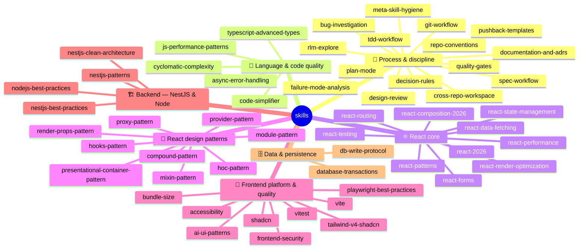

# Skill Catalog

54 skills in 7 families. The directories are **flat by requirement** — agent runtimes
(Claude Code, Codex, Cursor) discover skills as `skills/<name>/SKILL.md`, so grouping
lives here, not in the filesystem. Tier routing rules (what loads when) are in
`instructions.md` § P3.0 and § Skill Pointers; this page is the human-facing map.

## 🧭 Process & discipline — apply on any tier (15)

| Skill | What it gives you |
|---|---|
| [tdd-workflow](./tdd-workflow/SKILL.md) | Failing test first, the waiver phrases, the test-quality rubric |
| [spec-workflow](./spec-workflow/SKILL.md) | SPEC before code on behavioral changes; reconcile after |
| [plan-mode](./plan-mode/SKILL.md) | Plans for 3+ step / multi-file / architectural work |
| [design-review](./design-review/SKILL.md) | SOLID/DRY/KISS pass + the verification line, before declaring done |
| [failure-mode-analysis](./failure-mode-analysis/SKILL.md) | Edge cases enumerated BEFORE the failing test |
| [bug-investigation](./bug-investigation/SKILL.md) | Ranked falsifiable hypotheses before any fix |
| [decision-rules](./decision-rules/SKILL.md) | Defaults under ambiguity; the canonical skill-vs-repo conflict table |
| [pushback-templates](./pushback-templates/SKILL.md) | How to disagree: observation, tradeoff, question — one round |
| [documentation-and-adrs](./documentation-and-adrs/SKILL.md) | ADR format + the layered-router documentation principle |
| [repo-conventions](./repo-conventions/SKILL.md) | YOUR repo's binding facts (fill-in skeleton, both tiers + seam) |
| [git-workflow](./git-workflow/SKILL.md) | Branch/commit/PR mutations done safely |
| [quality-gates](./quality-gates/SKILL.md) | CI, pre-commit & permission-gate templates (deterministic enforcement) |
| [rlm-explore](./rlm-explore/SKILL.md) | Slice-based digestion of big or unfamiliar context |
| [cross-repo-workspace](./cross-repo-workspace/SKILL.md) | Lens-switching when one session spans two or more repos |
| [meta-skill-hygiene](./meta-skill-hygiene/SKILL.md) | Auditing this skill library itself (overlap, bloat, size ceilings) |

## 🔡 Language & code quality — any tier (5)

| Skill | What it gives you |
|---|---|
| [typescript-advanced-types](./typescript-advanced-types/SKILL.md) | Generics, conditional/mapped/template-literal types (index + topics) |
| [async-error-handling](./async-error-handling/SKILL.md) | Promise composition, AbortSignal, where to catch |
| [js-performance-patterns](./js-performance-patterns/SKILL.md) | Hot-path runtime performance (loops, large data, high-frequency events) |
| [code-simplifier](./code-simplifier/SKILL.md) | Surgical cleanup of recently-modified code, behavior preserved |
| [cyclomatic-complexity](./cyclomatic-complexity/SKILL.md) | Flattening branch-heavy, nested functions |

## ⚛️ React core — `apps/web` changes (10)

| Skill | What it gives you |
|---|---|
| [react-patterns](./react-patterns/SKILL.md) | Components, hooks, lifting state, refs, lists |
| [react-state-management](./react-state-management/SKILL.md) | WHERE state lives — the four-layer model; server data never in `useState` |
| [react-data-fetching](./react-data-fetching/SKILL.md) | Server data: caching, invalidation, optimistic updates |
| [react-routing](./react-routing/SKILL.md) | Routes, guards, expired-session flow, code-split per route |
| [react-forms](./react-forms/SKILL.md) | RHF + Zod, schema-first, accessible field errors |
| [react-performance](./react-performance/SKILL.md) | Rerender cost, memoization, virtualization — the overview |
| [react-render-optimization](./react-render-optimization/SKILL.md) | Deep render mechanics — 25 patterns (index + topics) |
| [react-testing](./react-testing/SKILL.md) | Vitest + Testing Library + Playwright layer choice |
| [react-composition-2026](./react-composition-2026/SKILL.md) | Modern composition idioms |
| [react-2026](./react-2026/SKILL.md) | The broader modern-React stack tour |

## 🧩 React design patterns (9)

| Skill | What it gives you |
|---|---|
| [hooks-pattern](./hooks-pattern/SKILL.md) | Custom hook design |
| [hoc-pattern](./hoc-pattern/SKILL.md) | Higher-order components |
| [render-props-pattern](./render-props-pattern/SKILL.md) | Render props |
| [provider-pattern](./provider-pattern/SKILL.md) | Context providers |
| [compound-pattern](./compound-pattern/SKILL.md) | Compound components sharing implicit state |
| [presentational-container-pattern](./presentational-container-pattern/SKILL.md) | Smart/dumb component split |
| [module-pattern](./module-pattern/SKILL.md) | Module encapsulation |
| [mixin-pattern](./mixin-pattern/SKILL.md) | Mixins (and when not to) |
| [proxy-pattern](./proxy-pattern/SKILL.md) | Proxies for interception |

## 🎨 Frontend platform & quality (9)

| Skill | What it gives you |
|---|---|
| [vite](./vite/SKILL.md) | Vite config & build optimization |
| [vitest](./vitest/SKILL.md) | Vitest config and test API |
| [playwright-best-practices](./playwright-best-practices/SKILL.md) | E2E patterns by framework & surface (index + topic dirs) |
| [shadcn](./shadcn/SKILL.md) | Day-to-day shadcn component work |
| [tailwind-v4-shadcn](./tailwind-v4-shadcn/SKILL.md) | Tailwind v4 + shadcn setup, theming, dark mode (index + topics) |
| [bundle-size](./bundle-size/SKILL.md) | Bundle audits, tree-shaking, lazy routes, dependency cost |
| [accessibility](./accessibility/SKILL.md) | Semantic HTML, ARIA, focus & keyboard rules for UI changes |
| [frontend-security](./frontend-security/SKILL.md) | XSS sinks, `VITE_*` leakage, token storage |
| [ai-ui-patterns](./ai-ui-patterns/SKILL.md) | Streaming/chat AI interface patterns |

## 🏗️ Backend — NestJS & Node — `apps/api` changes (4)

| Skill | What it gives you |
|---|---|
| [nestjs-best-practices](./nestjs-best-practices/SKILL.md) | 40 rules across 10 categories (arch, DI, security, perf, testing…) |
| [nestjs-clean-architecture](./nestjs-clean-architecture/SKILL.md) | 4-layer domain modules + the dependency rule |
| [nestjs-patterns](./nestjs-patterns/SKILL.md) | Tactical providers, Guards/Pipes/Interceptors, mixins (index + patterns) |
| [nodejs-best-practices](./nodejs-best-practices/SKILL.md) | Framework selection, async patterns, security defaults |

## 🗄️ Data & persistence (2)

| Skill | What it gives you |
|---|---|
| [database-transactions](./database-transactions/SKILL.md) | Multi-statement writes made atomic |
| [db-write-protocol](./db-write-protocol/SKILL.md) | Approval + impact protocol for ANY database write |

---

Adding a skill? Keep the directory flat, add it to its family table above (the acceptance
suite fails if a skill is missing from this catalog), and respect the size ceiling
(`meta-skill-hygiene` § Bloat: warn >400 lines, fail >800 — split into index + topics).
